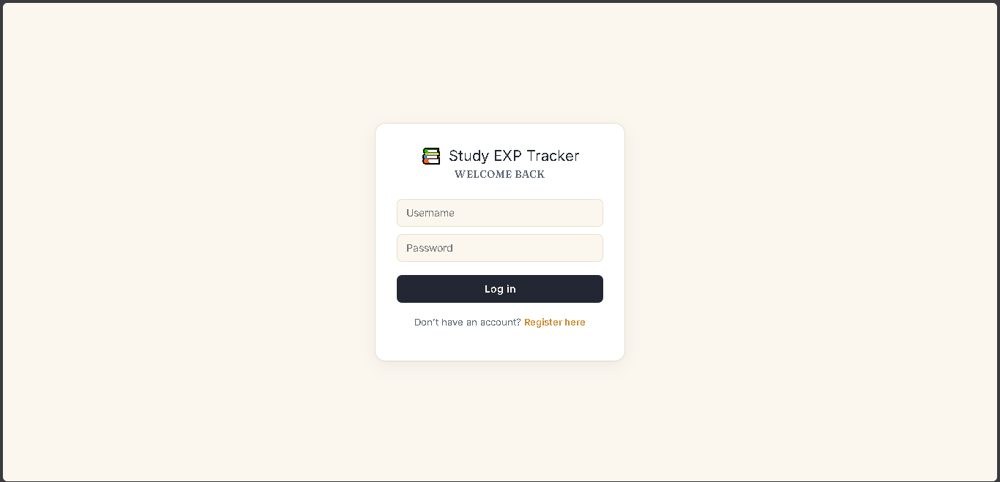
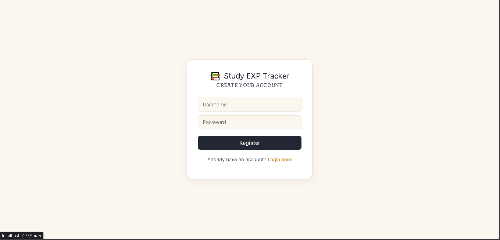
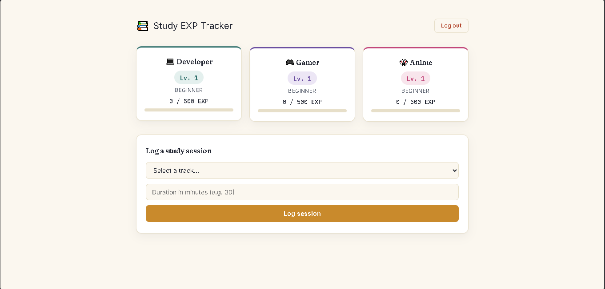

# Study EXP Tracker — Frontend

The React client for **Study EXP Tracker**, a gamified study app where logging study time earns experience points across three independent tracks — Developer, Gamer, and Anime.

Full project documentation, architecture, API details, and database schema are in the backend repo: [study-tracker-backend](https://github.com/vincentevangelista529/study-tracker-backend)

---

## Screenshots

**Login**


**Register**


**Dashboard**


## Tech Stack

React (Vite), React Router, Axios, custom CSS design system

## Running Locally

```bash
npm install
npm run dev
```

This app expects the backend API running at `http://localhost:5000`. See the [backend repo](https://github.com/vincentevangelista529/study-tracker-backend) for setup instructions.

## Author

**Vincent Evangelista**
[GitHub](https://github.com/vincentevangelista529) · [Portfolio](https://vincentevangelista.vercel.app/)
